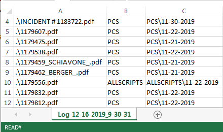

# pdfSort
Console tool to sort (or optionally categorize and move) PDF's based on type.  Currently supports the following types:

        * PCS
        * MAP2015
        * Charity
        * Allscripts
        * Transfer Center

NOTE: These must be formally generated forms.  Scanned documents are not able to be parsed.

## Usage
1. Navigate to the target directory and type (or copy/paste) the following:

       "G:\EMS-EAST\COMMUNICATIONS\_EMS Tools (Build Bins)\bin\pdfSort\pdfSort.exe"

2. The default behavior is to verify PDF's only.  If you truly wish to move/categorize the PDF's, see the next option.

## Usage (Move/Sort)
1. Navigate to the target directory and type (or copy/paste) the following:

       "G:\EMS-EAST\COMMUNICATIONS\_EMS Tools (Build Bins)\bin\pdfSort\pdfSort.exe" --move

2. NOTE: This option is destructive to the current file structure.

## Log File
A CSV log file will be generated in both instances which may be opened and viewed in Excel.  For example:

